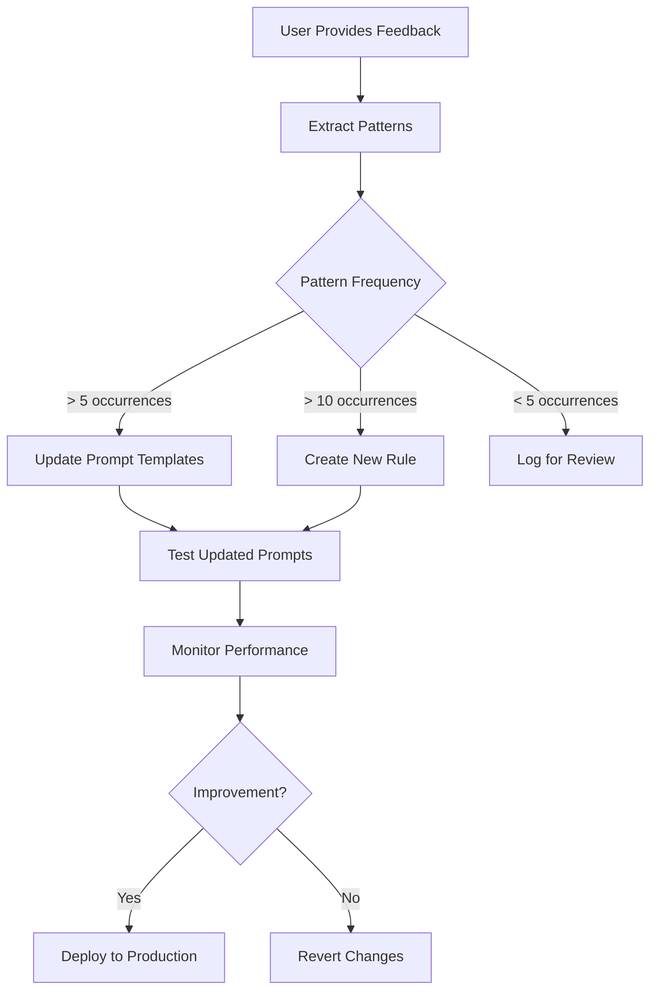

# Feedback Loop Optimization Guide

## Overview
This guide explains how to leverage user feedback to continuously improve AI accuracy, reduce processing time, and increase user satisfaction through pattern recognition and prompt refinement.

---

## Feedback Collection Strategy

### 1. Types of Feedback to Capture

#### 1.1 Explicit Corrections
```javascript
{
  "original_classification": "Task",
  "corrected_classification": "Story",
  "user_reasoning": "This involves multiple deliverables",
  "timestamp": "2024-01-15T10:30:00Z",
  "confidence_before": 75,
  "confidence_after": 95
}
```

#### 1.2 Context Additions
```javascript
{
  "missing_context": {
    "project_name": "Healthcare AI",
    "epic_reference": "Patient Portal",
    "technical_stack": "React, Node.js",
    "team_assignment": "Frontend Team"
  },
  "impact_on_confidence": +20
}
```

#### 1.3 Scope Clarifications
```javascript
{
  "original_scope": "vague",
  "clarified_scope": {
    "deliverables": ["Login page", "Password reset", "2FA setup"],
    "effort_days": 5,
    "dependencies": ["Auth service API"]
  }
}
```

#### 1.4 Rejection Reasons
```javascript
{
  "rejection_type": "wrong_classification",
  "details": "AI suggested Epic but this is clearly a Task",
  "pattern": "overestimating_scope"
}
```

---

## Pattern Recognition System

### 1. Feedback Analysis Pipeline

```javascript
// n8n Code Node: Analyze Feedback Patterns
const feedbackHistory = await getRecentFeedback(30); // Last 30 days

const patterns = {
  classificationErrors: {},
  missingContextTypes: {},
  confidenceCorrelations: {},
  commonCorrections: {},
  userPreferences: {}
};

// Analyze classification errors
feedbackHistory.forEach(feedback => {
  if (feedback.original_classification !== feedback.corrected_classification) {
    const key = `${feedback.original_classification}_to_${feedback.corrected_classification}`;
    patterns.classificationErrors[key] = (patterns.classificationErrors[key] || 0) + 1;
  }
});

// Identify missing context patterns
feedbackHistory.forEach(feedback => {
  if (feedback.missing_context) {
    Object.keys(feedback.missing_context).forEach(contextType => {
      patterns.missingContextTypes[contextType] = 
        (patterns.missingContextTypes[contextType] || 0) + 1;
    });
  }
});

// Confidence correlation analysis
const confidenceImprovements = feedbackHistory
  .filter(f => f.confidence_after > f.confidence_before)
  .map(f => ({
    improvement: f.confidence_after - f.confidence_before,
    feedback_type: categorizeUserFeedback(f.user_feedback)
  }));

// User preference detection
patterns.userPreferences = detectUserPreferences(feedbackHistory);

return { json: patterns };
```

### 2. Pattern Categories

#### 2.1 Classification Patterns
```javascript
const classificationPatterns = {
  // Common misclassifications
  "task_as_story": {
    frequency: 15,
    indicators: ["multiple deliverables mentioned", "vague timeline"],
    correction: "Check for multiple distinct deliverables"
  },
  
  "story_as_epic": {
    frequency: 8,
    indicators: ["uses word 'system'", "mentions 'platform'"],
    correction: "Look for 1-2 week scope, not multi-month"
  },
  
  "knowledge_as_task": {
    frequency: 12,
    indicators: ["contains 'document'", "says 'research'"],
    correction: "Check if deliverable is information vs implementation"
  }
};
```

#### 2.2 Context Patterns
```javascript
const contextPatterns = {
  // What users commonly need to add
  "project_context": {
    frequency: 45,
    solution: "Always ask for project if not mentioned"
  },
  
  "parent_relationship": {
    frequency: 38,
    solution: "Prompt for epic/story context"
  },
  
  "technical_details": {
    frequency: 27,
    solution: "Ask for tech stack when creating tasks"
  },
  
  "timeline_expectations": {
    frequency: 31,
    solution: "Request effort estimates explicitly"
  }
};
```

#### 2.3 User Preference Patterns
```javascript
const preferencePatterns = {
  "title_format": {
    preferred: "Action + Object (e.g., 'Create User Dashboard')",
    avoided: "Vague titles (e.g., 'Dashboard work')"
  },
  
  "description_detail": {
    preferred: "Bullet points with specific requirements",
    avoided: "Long paragraphs"
  },
  
  "hierarchy_depth": {
    preferred: "Shallow (Epic > Story > Task)",
    avoided: "Deep nesting (Epic > Sub-Epic > Story > Sub-Story > Task)"
  },
  
  "estimation_style": {
    preferred: "Hours for tasks, days for stories",
    avoided: "Story points or percentages"
  }
};
```

---

## Prompt Optimization Process

### 1. Dynamic Prompt Enhancement

```javascript
// n8n Code Node: Build Enhanced Prompt from Patterns
function buildOptimizedPrompt(basePrompt, patterns, userPreferences) {
  let enhancedPrompt = basePrompt;
  
  // Add classification warnings
  if (patterns.classificationErrors.task_to_story > 10) {
    enhancedPrompt += `
    WARNING: Users often correct Tasks to Stories. Check carefully for:
    - Multiple deliverables that should be separate tasks
    - Work spanning more than 3 days
    - Multiple people/skills required
    `;
  }
  
  // Add context requirements
  const missingContextList = Object.entries(patterns.missingContextTypes)
    .filter(([_, count]) => count > 5)
    .map(([type, _]) => type);
    
  if (missingContextList.length > 0) {
    enhancedPrompt += `
    REQUIRED CONTEXT (often missing):
    ${missingContextList.map(ctx => `- ${ctx}: [Ask user if not provided]`).join('\n')}
    `;
  }
  
  // Add user preferences
  if (userPreferences.title_format) {
    enhancedPrompt += `
    TITLE FORMAT: Always use "${userPreferences.title_format.preferred}"
    `;
  }
  
  return enhancedPrompt;
}
```

### 2. A/B Testing Prompts

```javascript
// n8n Code Node: A/B Test Different Prompts
const promptVariants = {
  A: standardPrompt,
  B: enhancedPromptWithPatterns,
  C: minimalPromptWithExamples
};

// Randomly assign variant
const variant = Object.keys(promptVariants)[Math.floor(Math.random() * 3)];
const selectedPrompt = promptVariants[variant];

// Track performance
const result = await analyzeWithPrompt(selectedPrompt);
result.variant = variant;
result.timestamp = new Date().toISOString();

// Store for analysis
await storePromptPerformance(result);

return { json: result };
```

### 3. Performance Tracking

```javascript
// n8n Code Node: Track Prompt Performance
const performanceMetrics = {
  promptVariant: "B",
  metrics: {
    averageConfidence: 82,
    approvalRate: 0.78,
    feedbackIterations: 1.2,
    processingTime: 4.5,
    userSatisfaction: 4.2
  },
  comparisonToBaseline: {
    confidenceImprovement: +15,
    approvalRateChange: +0.12,
    iterationReduction: -0.8,
    timeReduction: -1.5
  }
};

// Determine if variant should become new standard
if (performanceMetrics.metrics.approvalRate > 0.75 && 
    performanceMetrics.metrics.averageConfidence > 80) {
  await promoteVariantToStandard(performanceMetrics.promptVariant);
}
```

---

## Automated Learning Implementation

### 1. Feedback Processing Workflow



### 2. Pattern-Based Rule Generation

```javascript
// n8n Code Node: Generate Rules from Patterns
function generateRulesFromPatterns(patterns) {
  const rules = [];
  
  // Classification rules
  Object.entries(patterns.classificationErrors).forEach(([error, count]) => {
    if (count > 10) {
      const [from, to] = error.split('_to_');
      rules.push({
        type: 'classification_warning',
        condition: `potential_${from}`,
        action: `verify_not_${to}`,
        threshold: 0.7,
        message: `Users often change ${from} to ${to}. Double-check classification.`
      });
    }
  });
  
  // Context rules
  Object.entries(patterns.missingContextTypes).forEach(([context, count]) => {
    if (count > 20) {
      rules.push({
        type: 'context_requirement',
        field: context,
        action: 'request_if_missing',
        priority: count > 40 ? 'high' : 'medium',
        prompt: `Please specify ${context} for better classification`
      });
    }
  });
  
  return rules;
}
```

### 3. Continuous Improvement Loop

```javascript
// n8n Scheduled Workflow: Weekly Optimization
async function weeklyOptimization() {
  // 1. Collect week's feedback
  const weeklyFeedback = await getWeeklyFeedback();
  
  // 2. Analyze patterns
  const patterns = await analyzeFeedbackPatterns(weeklyFeedback);
  
  // 3. Generate optimization recommendations
  const recommendations = {
    promptUpdates: [],
    ruleAdditions: [],
    workflowAdjustments: []
  };
  
  // 4. Test recommendations
  const testResults = await testRecommendations(recommendations);
  
  // 5. Apply successful optimizations
  const applied = await applyOptimizations(
    recommendations.filter(r => r.testScore > 0.8)
  );
  
  // 6. Generate report
  return {
    feedbackProcessed: weeklyFeedback.length,
    patternsFound: Object.keys(patterns).length,
    optimizationsApplied: applied.length,
    expectedImprovement: calculateExpectedImprovement(applied)
  };
}
```

---

## User Preference Learning

### 1. Preference Detection

```javascript
// n8n Code Node: Detect User Preferences
function detectUserPreferences(userHistory) {
  const preferences = {
    namingConvention: detectNamingPattern(userHistory),
    detailLevel: detectDetailPreference(userHistory),
    hierarchyStyle: detectHierarchyPreference(userHistory),
    priorityTendency: detectPriorityPattern(userHistory)
  };
  
  // Naming convention detection
  function detectNamingPattern(history) {
    const approvedTitles = history
      .filter(h => h.approved)
      .map(h => h.final_title);
      
    // Analyze patterns
    const patterns = {
      verbFirst: approvedTitles.filter(t => /^(Create|Update|Fix|Add)/.test(t)).length,
      nounFirst: approvedTitles.filter(t => /^[A-Z][a-z]+/.test(t)).length,
      kebabCase: approvedTitles.filter(t => t.includes('-')).length,
      detailed: approvedTitles.filter(t => t.split(' ').length > 5).length
    };
    
    return Object.entries(patterns)
      .sort(([,a], [,b]) => b - a)[0][0];
  }
  
  return preferences;
}
```

### 2. Personalized Prompts

```javascript
// n8n Code Node: Build User-Specific Prompt
function buildPersonalizedPrompt(basePrompt, userPreferences, projectContext) {
  let personalizedPrompt = basePrompt;
  
  // Add user-specific formatting
  personalizedPrompt += `
  USER PREFERENCES (learned from history):
  - Title Format: ${userPreferences.namingConvention}
  - Detail Level: ${userPreferences.detailLevel}
  - Hierarchy: ${userPreferences.hierarchyStyle}
  - Priority Tendency: ${userPreferences.priorityTendency}
  
  PROJECT CONTEXT:
  - Active Project: ${projectContext.currentProject}
  - Recent Epics: ${projectContext.recentEpics.join(', ')}
  - Common Tags: ${projectContext.commonTags.join(', ')}
  `;
  
  return personalizedPrompt;
}
```

---

## Metrics and Monitoring

### 1. Key Performance Indicators

```javascript
const feedbackLoopKPIs = {
  // Accuracy metrics
  firstAttemptApprovalRate: 0.72, // Target: >0.80
  averageConfidenceScore: 78,      // Target: >85
  classificationAccuracy: 0.83,    // Target: >0.90
  
  // Efficiency metrics
  averageFeedbackIterations: 1.4,  // Target: <1.2
  processingTimeSeconds: 5.2,      // Target: <4.0
  userInteractionTime: 45,         // Target: <30
  
  // Learning metrics
  patternsIdentifiedWeekly: 12,
  promptOptimizationsApplied: 3,
  accuracyImprovementRate: 0.02,   // 2% per week
  
  // User satisfaction
  feedbackSentiment: 0.75,         // Target: >0.85
  adoptionRate: 0.68,              // Target: >0.80
  returnUserRate: 0.82             // Target: >0.90
};
```

### 2. Monitoring Dashboard

```javascript
// n8n Code Node: Generate Monitoring Dashboard Data
const dashboardData = {
  // Real-time metrics
  current: {
    activeItems: 24,
    pendingApproval: 8,
    averageConfidence: 76,
    lastHourApprovalRate: 0.71
  },
  
  // Trend analysis
  trends: {
    confidenceTrend: "improving", // +5% this week
    approvalRateTrend: "stable",
    feedbackVolumeTrend: "decreasing" // Good sign
  },
  
  // Pattern insights
  topPatterns: [
    {
      pattern: "Missing project context",
      frequency: 45,
      impact: "15% confidence reduction",
      recommendation: "Add project field to inbox template"
    },
    {
      pattern: "Task vs Story confusion",
      frequency: 23,
      impact: "Requires 1.8 iterations average",
      recommendation: "Enhance scope detection in prompt"
    }
  ],
  
  // Action items
  recommendations: generateActionItems(metrics, patterns)
};
```

### 3. Automated Improvements

```javascript
// n8n Scheduled Workflow: Auto-Apply Improvements
async function autoApplyImprovements() {
  const improvements = [];
  
  // Check confidence trends
  if (metrics.averageConfidence < 70) {
    improvements.push({
      type: 'prompt_enhancement',
      action: 'add_clarification_questions',
      priority: 'high'
    });
  }
  
  // Check classification accuracy
  if (patterns.classificationErrors.task_to_story > 15) {
    improvements.push({
      type: 'classification_rule',
      action: 'strengthen_task_criteria',
      priority: 'medium'
    });
  }
  
  // Check user satisfaction
  if (metrics.feedbackIterations > 1.5) {
    improvements.push({
      type: 'context_collection',
      action: 'require_additional_fields',
      priority: 'high'
    });
  }
  
  // Apply improvements
  for (const improvement of improvements) {
    await applyImprovement(improvement);
    await logImprovement(improvement);
  }
  
  return improvements;
}
```

---

## Best Practices

### 1. Feedback Collection
- Make feedback easy (one-click options)
- Capture feedback immediately after actions
- Provide feedback templates
- Track anonymous usage patterns

### 2. Pattern Analysis
- Require minimum occurrences before acting
- Consider context and user segments
- Validate patterns before implementing
- Monitor impact of changes

### 3. Continuous Improvement
- Set improvement targets
- A/B test all changes
- Maintain rollback capabilities
- Document all optimizations

### 4. User Communication
- Share improvement metrics
- Explain why changes were made
- Provide opt-out options
- Celebrate accuracy improvements

---

## Implementation Checklist

- [ ] Set up feedback collection in Notion
- [ ] Create pattern analysis workflow in n8n
- [ ] Implement A/B testing framework
- [ ] Build monitoring dashboard
- [ ] Create automated optimization workflow
- [ ] Set up performance tracking
- [ ] Document optimization history
- [ ] Train team on feedback importance
- [ ] Establish review schedule
- [ ] Create improvement reports