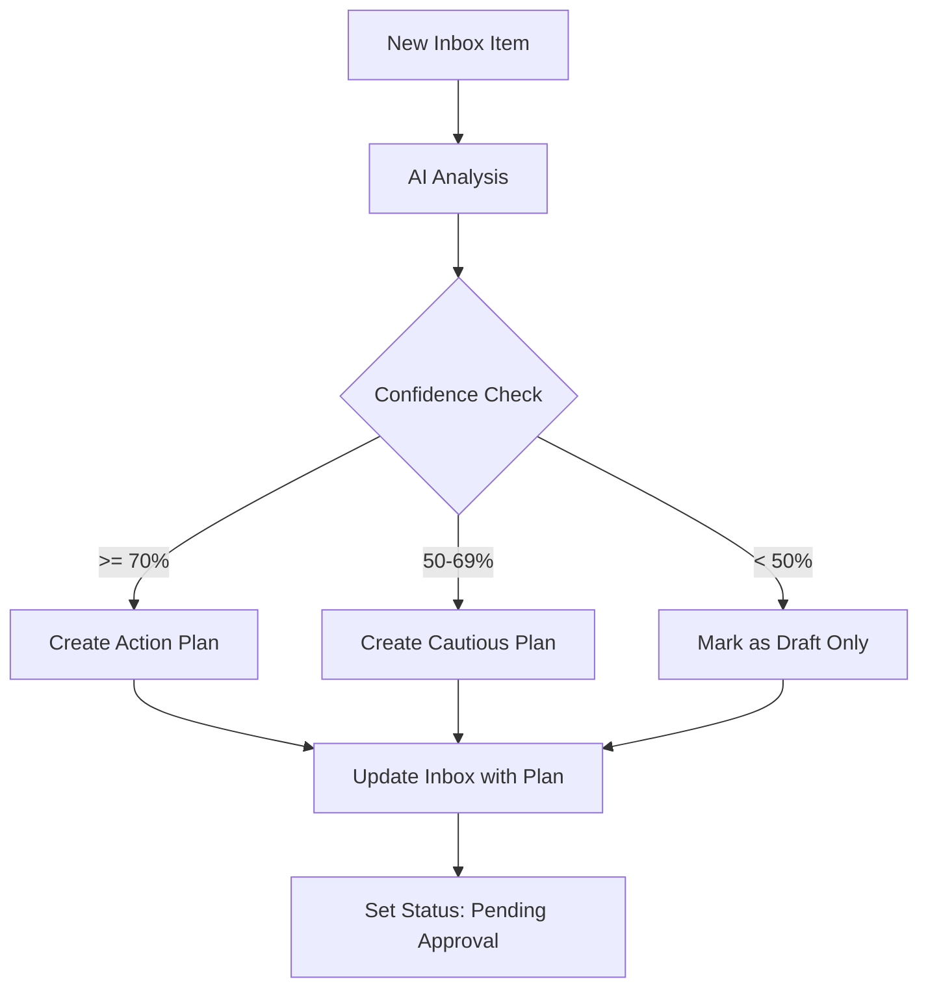

# Intelligent Inbox Processing Workflow V2
## With Confidence Scoring, Draft Mode, and Approval Workflow

### Overview
This enhanced workflow processes inbox items with:
- **Confidence scoring** (0-100%) displayed prominently
- **Draft mode** for items needing more information
- **User approval workflow** with feedback loop
- **Precise action planning** before execution
- **Iterative improvement** through user corrections

---

## Required Database Changes

### Add to Inbox Database Properties:
```javascript
{
  // Existing properties remain...
  
  // New properties to add:
  "AI Confidence": {
    type: "number",
    format: "percent",
    description: "AI's confidence in its analysis (0-100%)"
  },
  "Processing Status": {
    type: "select",
    options: ["Draft", "Pending Approval", "Approved", "Processing", "Completed", "Rejected"],
    default: "Draft"
  },
  "AI Action Plan": {
    type: "rich_text",
    description: "Detailed plan from AI analysis"
  },
  "User Feedback": {
    type: "rich_text", 
    description: "User corrections and additional context"
  },
  "Approval Actions": {
    type: "select",
    options: ["Approve", "Update Entry", "Discard"],
    description: "User's decision on the AI plan"
  },
  "Processing Attempts": {
    type: "number",
    default: 0,
    description: "Number of analysis iterations"
  },
  "Confidence Reasoning": {
    type: "rich_text",
    description: "Why AI has this confidence level"
  }
}
```

---

## Workflow Architecture

### Phase 1: Initial Analysis with Confidence



#### 1.1 Enhanced AI Analysis Node
```javascript
// n8n Code Node: Enhanced AI Analysis with Confidence
const inboxItem = $input.item.json;

// Build comprehensive analysis prompt
const analysisPrompt = `
You are an AI assistant for a Project Management System. Analyze this inbox entry and create a detailed action plan.

SYSTEM CONTEXT:
- Projects are top-level strategic containers
- Epics are major initiatives within projects (1-3 months)
- Stories are features/capabilities within epics (1-2 weeks)  
- Tasks are specific work items within stories (1-3 days)
- Knowledge Base stores reusable documentation

INBOX ENTRY TO ANALYZE:
Title: ${inboxItem.Note}
Content: ${inboxItem.Comments || "No additional content"}
Priority: ${inboxItem.Priority || "Medium"}
Tags: ${inboxItem.Tags?.join(", ") || "None"}
Created: ${inboxItem["Created Date"]}
${inboxItem["User Feedback"] ? `Previous Feedback: ${inboxItem["User Feedback"]}` : ""}
Attempt Number: ${(inboxItem["Processing Attempts"] || 0) + 1}

CLASSIFICATION RULES:
1. Task: Single deliverable, clear action, 1-3 days work
2. Story: User-facing feature, multiple tasks, 1-2 weeks
3. Epic: Major initiative, multiple stories, 1-3 months
4. Knowledge: Documentation, learnings, reference material
5. Question: Needs clarification before processing
6. Update: Modification to existing item

CONFIDENCE SCORING GUIDELINES:
- 90-100%: Crystal clear classification, obvious parent items, all info present
- 70-89%: Clear intent but making reasonable assumptions
- 50-69%: Multiple valid interpretations, missing key context
- 30-49%: Very ambiguous, need significant clarification
- 0-29%: Cannot determine intent, need user input

REQUIRED OUTPUT (Valid JSON):
{
  "confidence": [0-100],
  "confidence_reasoning": "Detailed explanation of confidence score",
  "classification": "Task|Story|Epic|Knowledge|Question|Update",
  "classification_reasoning": "Why this classification was chosen",
  
  "action": "CREATE_NEW|UPDATE_EXISTING|LINK_RELATED|SPLIT_MULTIPLE|DRAFT_ONLY",
  "action_reasoning": "Why this action is recommended",
  
  "action_plan": {
    "summary": "One-line summary of what will be done",
    "detailed_steps": [
      "Step 1: Specific action with entity type and title",
      "Step 2: How it will be linked or organized",
      "Step 3: Additional configuration or setup"
    ],
    
    "creates": [
      {
        "type": "task|story|epic|knowledge",
        "title": "Clear, actionable title",
        "description": "Detailed description",
        "acceptance_criteria": ["Criterion 1", "Criterion 2"],
        "parent_story": "Story title to link to (if applicable)",
        "parent_epic": "Epic title to link to (if applicable)", 
        "parent_project": "Project name (if applicable)",
        "priority": "Critical|High|Medium|Low",
        "tags": ["tag1", "tag2"],
        "estimated_effort": "2 hours|3 days|1 week"
      }
    ],
    
    "updates": [
      {
        "type": "task|story|epic",
        "search_title": "Title to search for",
        "changes": {
          "append_to_description": "Text to add",
          "new_status": "Status to set",
          "add_tags": ["tag1", "tag2"]
        }
      }
    ],
    
    "links": [
      {
        "from_type": "inbox",
        "to_type": "knowledge|task|story",
        "search_terms": ["term1", "term2"],
        "relationship": "references|implements|documents"
      }
    ]
  },
  
  "search_suggestions": {
    "projects": ["Project Name 1", "Project Name 2"],
    "epics": ["Epic Title 1", "Epic Title 2"],
    "stories": ["Story Title 1", "Story Title 2"],
    "keywords": ["keyword1", "keyword2", "technical-term"]
  },
  
  "clarification_needed": [
    "What specific aspect needs clarification",
    "What additional context would help"
  ],
  
  "alternative_interpretations": [
    {
      "classification": "Alternative type",
      "confidence": 60,
      "reasoning": "Why this could also be valid"
    }
  ]
}

IMPORTANT:
- Be specific with titles and descriptions
- Always explain your confidence level
- Suggest searches even if not certain
- List what information would increase confidence
- Consider user feedback from previous attempts
`;

// Call AI service
const aiResponse = await $helpers.request({
  method: 'POST',
  url: 'https://api.openai.com/v1/chat/completions',
  headers: {
    'Authorization': `Bearer ${process.env.OPENAI_API_KEY}`,
    'Content-Type': 'application/json'
  },
  body: {
    model: 'gpt-4',
    messages: [
      {
        role: 'system',
        content: 'You are a project management AI that provides structured JSON responses for inbox processing.'
      },
      {
        role: 'user', 
        content: analysisPrompt
      }
    ],
    temperature: 0.3, // Lower temperature for consistency
    max_tokens: 2000
  }
});

const analysis = JSON.parse(aiResponse.choices[0].message.content);

// Add visual confidence indicator
analysis.confidence_visual = 
  analysis.confidence >= 90 ? "🟢" :
  analysis.confidence >= 70 ? "🟡" :
  analysis.confidence >= 50 ? "🟠" :
  "🔴";

return {
  json: {
    ...inboxItem,
    ai_analysis: analysis
  }
};
```

#### 1.2 Format Action Plan for User
```javascript
// n8n Code Node: Format Action Plan
const analysis = $input.item.json.ai_analysis;

// Create user-friendly action plan
const formattedPlan = `
# AI Analysis Result ${analysis.confidence_visual}

**Confidence Level**: ${analysis.confidence}% - ${analysis.confidence_reasoning}

**Classification**: ${analysis.classification}
*Reasoning*: ${analysis.classification_reasoning}

**Recommended Action**: ${analysis.action}
*Reasoning*: ${analysis.action_reasoning}

## Planned Actions:

${analysis.action_plan.summary}

### Detailed Steps:
${analysis.action_plan.detailed_steps.map((step, i) => `${i + 1}. ${step}`).join('\n')}

### What Will Be Created:
${analysis.action_plan.creates.map(item => 
  `- **${item.type}**: "${item.title}"\n  Priority: ${item.priority}, Effort: ${item.estimated_effort}`
).join('\n\n')}

### What Will Be Updated:
${analysis.action_plan.updates.length > 0 ? 
  analysis.action_plan.updates.map(item => 
    `- **${item.type}**: "${item.search_title}"\n  Changes: ${Object.keys(item.changes).join(', ')}`
  ).join('\n\n') : 
  'No updates planned'}

### Related Items to Link:
${analysis.action_plan.links.map(link => 
  `- Search for ${link.to_type} containing: ${link.search_terms.join(', ')}`
).join('\n')}

${analysis.clarification_needed.length > 0 ? `
### ⚠️ Clarification Needed:
${analysis.clarification_needed.map(q => `- ${q}`).join('\n')}
` : ''}

${analysis.alternative_interpretations.length > 0 ? `
### Alternative Interpretations:
${analysis.alternative_interpretations.map(alt => 
  `- Could be ${alt.classification} (${alt.confidence}% confidence): ${alt.reasoning}`
).join('\n')}
` : ''}

---
**Next Steps**: Review this plan and choose:
- ✅ **Approve** - Execute this plan as described
- 📝 **Update Entry** - Add more context and re-analyze
- ❌ **Discard** - Cancel processing
`;

return {
  json: {
    ...input.item.json,
    formatted_plan: formattedPlan
  }
};
```

### Phase 2: User Review and Approval

#### 2.1 Update Inbox Item for Review
```javascript
// n8n Notion Node: Update Inbox for Review
{
  resource: 'page',
  operation: 'update',
  pageId: '={{$json.id}}',
  properties: {
    'AI Confidence': {
      number: '={{$json.ai_analysis.confidence}}'
    },
    'Processing Status': {
      select: { 
        name: '={{$json.ai_analysis.confidence < 50 ? "Draft" : "Pending Approval"}}'
      }
    },
    'AI Action Plan': {
      rich_text: [{
        text: {
          content: '={{$json.formatted_plan}}'
        }
      }]
    },
    'Confidence Reasoning': {
      rich_text: [{
        text: {
          content: '={{$json.ai_analysis.confidence_reasoning}}'
        }
      }]
    },
    'Processing Attempts': {
      number: '={{($json["Processing Attempts"] || 0) + 1}}'
    }
  }
}
```

#### 2.2 Wait for User Decision
```javascript
// This would be implemented as:
// 1. Webhook trigger waiting for Notion page update
// 2. OR scheduled check for items pending approval
// 3. OR manual trigger from Notion button/automation

// n8n Webhook Node: Wait for Approval
{
  httpMethod: 'POST',
  path: 'inbox-approval-webhook',
  responseMode: 'onReceived',
  filters: {
    'Processing Status': 'Pending Approval',
    'Approval Actions': ['Approve', 'Update Entry', 'Discard']
  }
}
```

### Phase 3: Execute Based on Approval

#### 3.1 Decision Router
```javascript
// n8n Switch Node: Route by User Decision
const decision = $input.item.json['Approval Actions'];
const confidence = $input.item.json.ai_analysis.confidence;

switch(decision) {
  case 'Approve':
    // Route to execution workflow
    return { output: 'execute' };
    
  case 'Update Entry':
    // Route back to analysis with feedback
    return { output: 'reanalyze' };
    
  case 'Discard':
    // Route to archive/cleanup
    return { output: 'archive' };
    
  default:
    // No action yet, continue waiting
    return { output: 'wait' };
}
```

#### 3.2 Execution with Confidence Handling
```javascript
// n8n Code Node: Confidence-Based Execution
const analysis = $input.item.json.ai_analysis;
const confidence = analysis.confidence;

// Prepare execution plan based on confidence
let executionConfig = {
  autoExecute: false,
  requireConfirmation: true,
  createAsDraft: false,
  notificationLevel: 'normal'
};

if (confidence >= 90) {
  executionConfig = {
    autoExecute: true,
    requireConfirmation: false,
    createAsDraft: false,
    notificationLevel: 'summary'
  };
} else if (confidence >= 70) {
  executionConfig = {
    autoExecute: true,
    requireConfirmation: false,
    createAsDraft: false,
    notificationLevel: 'detailed'
  };
} else if (confidence >= 50) {
  executionConfig = {
    autoExecute: true,
    requireConfirmation: true,
    createAsDraft: true,
    notificationLevel: 'verbose'
  };
} else {
  // Low confidence - create review task only
  executionConfig = {
    autoExecute: false,
    requireConfirmation: true,
    createAsDraft: true,
    notificationLevel: 'alert',
    createReviewTask: true
  };
}

// Add execution config to the workflow
return {
  json: {
    ...input.item.json,
    executionConfig
  }
};
```

### Phase 4: Feedback Loop Processing

#### 4.1 Re-analysis with User Feedback
```javascript
// n8n Code Node: Process User Feedback
const previousAnalysis = $input.item.json.ai_analysis;
const userFeedback = $input.item.json['User Feedback'];
const attemptNumber = $input.item.json['Processing Attempts'] || 1;

// Build enhanced prompt with feedback
const feedbackPrompt = `
Previous Analysis (Attempt ${attemptNumber - 1}):
- Classification: ${previousAnalysis.classification}
- Confidence: ${previousAnalysis.confidence}%
- Action: ${previousAnalysis.action}

User Feedback:
"${userFeedback}"

Based on this feedback, please re-analyze the inbox item with the following emphasis:
1. What did the user correct or clarify?
2. How does this change your classification or action plan?
3. What specific details from the feedback should influence the new plan?

IMPORTANT: 
- Increase confidence if user provided clear direction
- Adjust classification if user indicated a different type
- Include any specific items/projects/epics mentioned by user
- Learn from what was wrong in previous attempt
`;

// Re-run analysis with feedback context
// ... (similar to Phase 1 but with enhanced prompt)
```

#### 4.2 Learning from Patterns
```javascript
// n8n Code Node: Track Feedback Patterns
const feedbackPatterns = {
  classification_corrections: {},
  common_clarifications: [],
  confidence_adjustments: []
};

// Analyze what users commonly correct
if (previousClassification !== newClassification) {
  feedbackPatterns.classification_corrections[previousClassification] = 
    (feedbackPatterns.classification_corrections[previousClassification] || 0) + 1;
}

// Store patterns for future improvement
// This data can be used to refine prompts and improve accuracy
```

---

## Implementation Checklist

### 1. Database Setup
- [ ] Add all new properties to Inbox database
- [ ] Create views filtered by Processing Status
- [ ] Add approval buttons/automation in Notion

### 2. n8n Workflow Setup
- [ ] Create main analysis workflow
- [ ] Create approval webhook/trigger
- [ ] Create execution workflow
- [ ] Create feedback processing workflow
- [ ] Create monitoring/metrics workflow

### 3. Testing Scenarios
- [ ] High confidence task creation
- [ ] Medium confidence story creation  
- [ ] Low confidence draft mode
- [ ] Feedback loop iteration
- [ ] Multiple interpretation handling

### 4. Monitoring & Optimization
- [ ] Track confidence accuracy
- [ ] Monitor user approval rates
- [ ] Analyze feedback patterns
- [ ] Adjust prompts based on results

---

## Benefits of This Approach

1. **Transparency**: Users see exactly what will happen before execution
2. **Safety**: Low confidence items don't create wrong entries
3. **Learning**: System improves through user feedback
4. **Flexibility**: Draft mode for complex items
5. **Control**: Users maintain final decision authority

---

## Next Steps

1. Implement database changes in Notion
2. Build the n8n workflows following this guide
3. Test with sample inbox items
4. Refine prompts based on results
5. Document common patterns and solutions